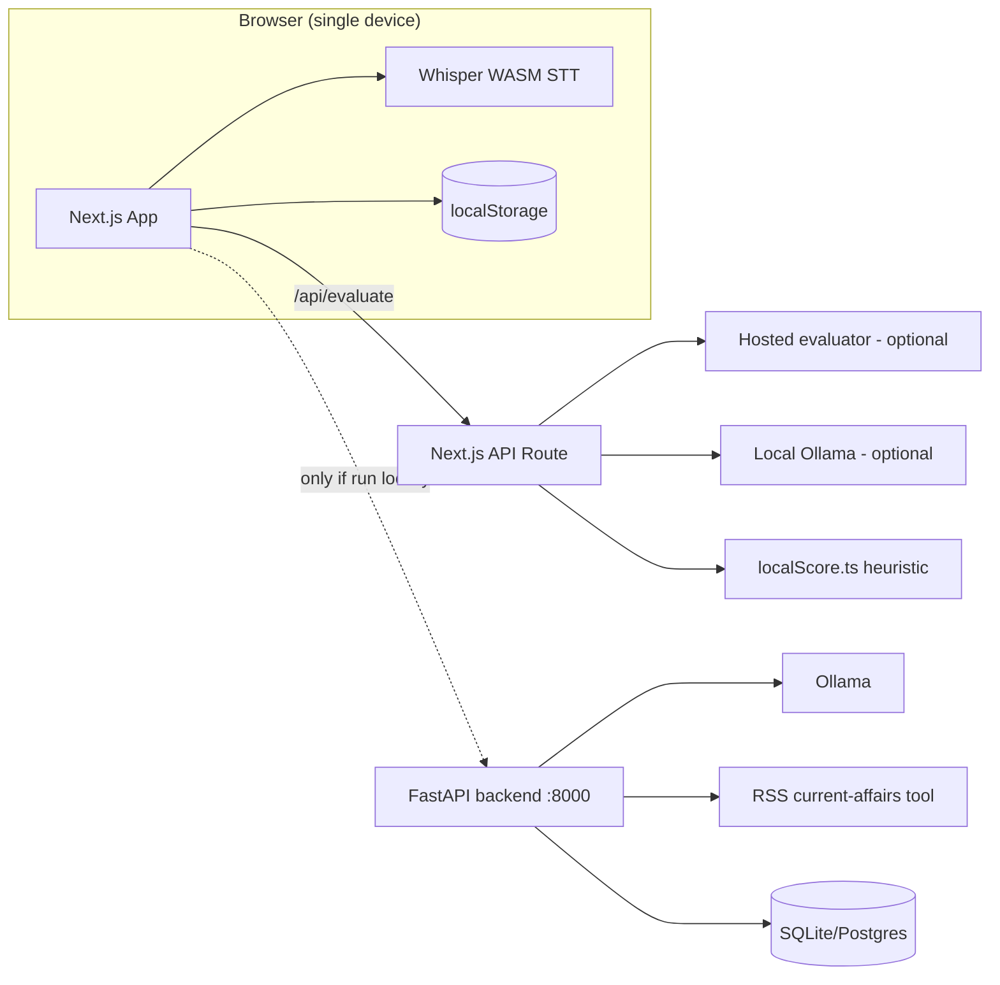
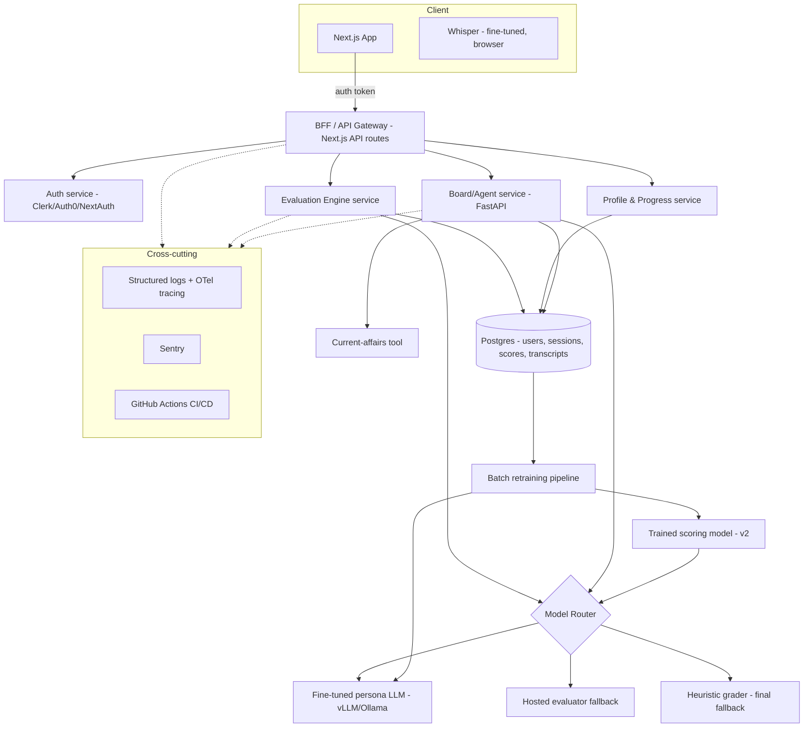

# SpeakEasy — Engineering & Product Roadmap
**From portfolio project to a fundable product**
Prepared by: Head of Engineering (acting) · Date: August 2026 · Status: Draft v1.0

---

## 0. Purpose & how to read this

This is the technical roadmap I'd put in front of a co-founder or a first engineering hire if we decided to take SpeakEasy from a solo side-project to a real product. It's organized the way a Series-Seed engineering plan usually is: **honest baseline → target architecture → phased execution → risks**. Every gap listed below is verified against the current repo, not guessed — I've cited the actual files.

---

## 1. Executive summary

SpeakEasy today is a **client-heavy, single-device, single-contributor prototype** that proves the hard part works: browser-based STT (Whisper), a 3-tier LLM/heuristic scoring fallback that resists gaming, and an agentic mock-interview panel with persona routing. That is a legitimately hard product surface to build solo, and it works.

What it is **not** yet: multi-user, persistent across devices, monitored, tested, deployed as a full stack, or backed by any data flywheel. Those are the gaps that separate "cool demo" from "startup." None of them are exotic — they're the standard path every early-stage AI product takes — but they need to be sequenced correctly or we'll rebuild the same thing twice.

**The core product bet, stated plainly:** the value isn't the timer or the recorder — anyone can build those. The value is *"can this thing give feedback a candidate actually trusts."* Every phase below is ordered to protect that bet first and add scale/infra around it second, not the other way around.

---

## 2. Current state — honest baseline

| Layer | What exists today | Evidence |
|---|---|---|
| Frontend | Next.js 16 / React 19 / TS, deployed on Vercel | `package.json`, live URL |
| Persistence | 100% client-side `localStorage` — no accounts, no cross-device sync, no server record of a user | README: "All progress is on-device" |
| STT | Stock Whisper via `@huggingface/transformers`, WASM, in-browser | `whisperTranscribe.ts` |
| Scoring | 3-tier fallback: hosted evaluator → local Ollama LLM → hand-written regex/heuristic grader | `openSource.ts`, `localScore.ts` |
| Board interview backend | FastAPI + SQLite/Postgres, agentic planner→tool→generator loop, RSS current-affairs tool | `backend/app/agent/*` |
| Question generation | Prompted Ollama (`qwen2.5:7b`) + hardcoded, hash-selected fallback banks per persona | `generator.py`, `personas.py` |
| Eval harness | 5 seeded DAF profiles, `/eval/run` + `/eval/results` | `backend/app/eval/` |
| CI/CD | **None** — zero `.github/workflows`, zero test files anywhere in the repo | verified via repo search |
| Auth | **None** | — |
| Deployment | Frontend on Vercel (prod). Backend **local-only** — board interview cannot be demoed from the live URL today | `backend/README.md` |
| Fine-tuning / trained models | **None.** Every model in the pipeline is stock or prompted, not trained | verified across `generator.py`, `ollama_client.py`, `whisperTranscribe.ts` |
| Observability | None — no structured logging, no tracing, no error monitoring | — |

This is a strong V0. It is not a system anyone else could operate, debug at 2am, or trust with real user data yet. That's what the roadmap fixes.

---

## 3. Target architecture

### 3.1 Current architecture (as of today)

**Problem with this shape:** there are two disconnected backends (Next API route + FastAPI), no shared user identity, no shared model layer, and the entire "real" backend only runs on localhost.

### 3.2 Target architecture (Phase 3 end-state)

**Key structural changes from today:**
1. One **Evaluation Engine** service instead of scoring logic split between a Next.js API route and a separate FastAPI eval harness.
2. **Postgres becomes the source of truth**, `localStorage` becomes a cache/offline-fallback, not the primary store.
3. A **Model Router** abstraction so "which model answers this" is a config/business decision, not hardcoded per-feature — this is what lets the fine-tuned models from the previous discussion (persona LLM, Indian-English Whisper, eventual trained scorer) slot in without a rewrite.
4. A **batch retraining pipeline** turns production usage into the data flywheel that's currently impossible (nothing persists server-side today).

---

## 4. Phased roadmap

### Phase 0 — Stabilize the foundation (Weeks 1–4)
*Goal: make the existing thing safe to build on top of. No new features.*

| Deliverable | Why |
|---|---|
| GitHub Actions CI: lint + `tsc --noEmit` + `next build` (frontend), `ruff` + `pytest` (backend) | Zero CI today is the single biggest liability |
| Unit tests for `localScore.ts` and `run_eval.py` cases | These are pure logic, cheap to test, and are the trust-critical path |
| Deploy FastAPI backend to Fly.io/Railway with managed Postgres | Board feature currently can't be demoed live |
| Structured logging (`structlog`/`pino`) across both services | Prerequisite for everything in Phase 1+ |
| Sentry on frontend + backend | Cheapest possible monitoring win |

**Exit criteria:** a PR that breaks the grader or the agent loop fails CI before merge. The live URL can demo the board feature end-to-end.

### Phase 1 — Real backend, real accounts (Months 2–3)
*Goal: move from "device" to "user."*

- Add auth (Clerk or NextAuth + Postgres sessions) — lowest-lift path is Clerk given solo/small-team bandwidth.
- Migrate `profile.ts` / `storage.ts` (history, streaks, evaluation archive) from `localStorage` to Postgres, keyed by user ID. Keep `localStorage` as an offline cache with background sync — don't break the "works with no account" demo path entirely, gate it behind a "save my progress" upsell instead.
- Merge the Next.js `/api/evaluate` route and the FastAPI `/eval` harness into one **Evaluation Engine** boundary (can still be a FastAPI service — just stop having two places that know how scoring works).
- Add the **Model Router** abstraction now, even before fine-tuned models exist — it's the seam that makes Phase 2 non-disruptive.

**Exit criteria:** a user can sign in on their phone and see the same history they built on their laptop.

### Phase 2 — Data flywheel & model layer (Months 3–6)
*This is the phase that turns "prompted LLM app" into something with real ML IP — ties directly to the fine-tuning discussion above.*

- Add opt-in server-side logging of `(transcript, rubric scores, model version, prompt version)` — this is the dataset that doesn't exist today and blocks everything else in this phase.
- LoRA fine-tune a small open model (Qwen2.5-7B, matches current Ollama usage) on persona-styled Q&A pairs seeded from the existing hand-written fallback banks in `generator.py`. Ship it behind the Model Router as a new tier; A/B against the prompted baseline using the extended eval harness (grow from 5 to ~30 seeded DAF profiles).
- Fine-tune a small Whisper checkpoint on Indian-English speech data, export to ONNX, swap into `whisperTranscribe.ts` behind a flag. Measure WER improvement on a held-out Indian-English test set before rolling out to 100%.
- Once ~500+ labeled examples exist from the logging above, prototype a trained scoring model (start with gradient-boosted trees on hand-crafted features — `topicOverlap`, filler-word ratio, etc. — before jumping to a fine-tuned transformer) as a candidate to eventually replace/augment `localScore.ts`.

**Exit criteria:** at least one fine-tuned artifact is in production with a measured before/after metric (WER, persona-consistency score, or eval-harness win rate) — not a claim, a number.

### Phase 3 — Scale & multi-tenancy (Months 6–9)

- Rate limiting + abuse prevention on `/api/evaluate` and `/board/*` (currently unmetered — a single bad actor can burn your hosted-evaluator budget).
- Queue-based processing for essay/PDF evaluation and Whisper fallback on low-end devices (server-side STT option for devices where WASM Whisper chokes — mentioned as a known failure mode in your own README re: Cursor's embedded browser).
- Infra-as-code (Terraform) once you're running more than "Vercel + one Fly.io box" — not before, it's premature at 1-2 services.
- Full OpenTelemetry tracing across Gateway → Evaluation Engine → Model Router → Ollama/hosted LLM, with per-stage latency dashboards. You already log `tool_call_logs` for the agent loop — this extends that instinct system-wide.

**Exit criteria:** you can answer "what's our p95 evaluation latency and what's it costing us per session" without guessing.

### Phase 4 — Monetization & growth (Months 9–12)

- Freemium tiers: unlimited heuristic-graded practice free; LLM-graded sessions and board-interview credits metered.
- Payments: Razorpay (target market is India-first — UPSC/IES/IFS/PSU aspirants), not Stripe-first.
- Usage-based cost tracking per user tied into the Model Router (you'll already have latency/cost logging from Phase 3 — reuse it for billing, don't build a second system).
- Content/coverage expansion: more exam tracks, state-specific PSU boards, group-discussion multi-speaker mode.

**Exit criteria:** first cohort of paying users, with unit economics (LLM cost per graded session vs. revenue per user) actually computed, not assumed.

---

## 5. Security, privacy & compliance — don't skip this

This product collects **voice recordings and DAF personal data** (home state, education, work history, hobbies) from users who are, disproportionately, prepping for *government service exams* — a population that will reasonably care about data handling.

- Define an explicit audio/transcript retention policy (how long, deletable on request) before Phase 1 ships accounts — retrofitting this after users exist is much harder.
- India's **Digital Personal Data Protection Act (DPDP)** applies given the target market — consent language and data-deletion flows need to exist before charging money for the product, not after.
- Recorded audio + DAF data is sensitive enough that "we'll add security later" is not an acceptable sequencing — bake it into Phase 1's Postgres migration, not a later cleanup pass.

---

## 6. Team & hiring (if this becomes a real company)

Right now: solo. In rough priority order as funding/bandwidth allows:
1. **Backend/infra engineer** — to own Phase 1–3 (auth, data migration, observability) while the ML fine-tuning work happens in parallel rather than sequentially.
2. **ML engineer** — owns Phase 2's fine-tuning + data flywheel; this is the highest-leverage hire since it's the actual defensible IP.
3. **Founding generalist/PM** — validates the monetization assumptions in Phase 4 before you over-build them.

Don't hire for DevOps/SRE specifically until Phase 3 — before that, the infra is small enough that a generalist backend engineer covers it.

---

## 7. Risks & open questions — stated plainly, not softened

- **Judge trust is the product, and it's unsolved at scale.** The 3-tier fallback is a smart way to avoid embarrassing failures, but "does this feedback actually correlate with what a real UPSC panel would say" is an open empirical question, not something the architecture answers by itself. This needs actual expert validation (real board members reviewing a sample of AI scores), not just eval-harness self-consistency.
- **Market size vs. willingness to pay is unverified.** UPSC/competitive-exam aspirant volume in India is large, but most of that market is extremely price-sensitive and already has free/cheap alternatives (YouTube mock interviews, Telegram groups). The monetization phase should validate willingness-to-pay with a small paid pilot before building billing infrastructure.
- **Whisper-in-browser is a genuine constraint, not a feature, past a certain scale.** It's a good cost-saving move at zero users; it's also the reason certain browsers/devices fail today (per your own README). Phase 3's server-side STT fallback isn't optional if you want broad device support.
- **Solo-maintainer bus factor.** Everything above assumes engineering bandwidth that doesn't currently exist. Phase 0 and Phase 1 are sized to be doable solo; Phase 2 onward realistically needs at least one more engineer.

---

## 8. Immediate next steps (2-week sprint, starting now)

1. Add the GitHub Actions CI workflow (lint + build + test) — half a day, zero excuses for not having this.
2. Write unit tests for `localScore.ts` (a dozen cases covering the zero-score paths, filler detection, topic overlap).
3. **Board live for everyone:** ship board via Next.js `/api/board/*` on Vercel (do **not** point prod at `localhost:8000`). Optional later: Fly.io FastAPI + Ollama; optional `EVALUATOR_URL` on Vercel for cloud LLM questions.
4. Add Sentry (DSN optional — no-op until configured) on API error paths.
5. Write the data-retention/consent policy doc (`DATA_RETENTION.md`) before touching auth in Phase 1.

**Progress note:** items 1–5 reflected in-repo (`speak_readme.md`). Never set `NEXT_PUBLIC_BACKEND_URL` on Vercel to localhost.

---

*This document is a living plan, not a commitment — revisit at the end of each phase and cut anything that isn't earning its complexity.*
